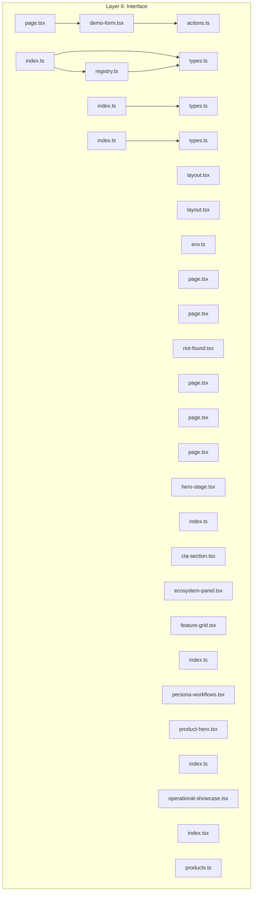

# Architecture Visual Map

<!-- For AI coding agents: read knowledge/architecture/context-map.md or run npx stubs query "map:" -->

```mermaid
flowchart TD
  subgraph L6 ["Layer 6: Interface"]
    n_src_app_demo_page_tsx["page.tsx"]
    n_src_app_layout_tsx["layout.tsx"]
    n_src_components_layout_tsx["layout.tsx"]
    n_src_env_ts["env.ts"]
    n_src_app_demo_actions_ts["actions.ts"]
    n_src_app_demo_demo_form_tsx["demo-form.tsx"]
    n_src_app_page_tsx["page.tsx"]
    n_src_app_privacy_page_tsx["page.tsx"]
    n_src_app_products__slug__not_found_tsx["not-found.tsx"]
    n_src_app_products__slug__page_tsx["page.tsx"]
    n_src_app_products_page_tsx["page.tsx"]
    n_src_app_terms_page_tsx["page.tsx"]
    n_src_components_hero_hero_stage_tsx["hero-stage.tsx"]
    n_src_components_hero_index_ts["index.ts"]
    n_src_components_sections_cta_section_tsx["cta-section.tsx"]
    n_src_components_sections_ecosystem_panel_tsx["ecosystem-panel.tsx"]
    n_src_components_sections_feature_grid_tsx["feature-grid.tsx"]
    n_src_components_sections_index_ts["index.ts"]
    n_src_components_sections_persona_workflows_tsx["persona-workflows.tsx"]
    n_src_components_sections_product_hero_tsx["product-hero.tsx"]
    n_src_components_showcase_index_ts["index.ts"]
    n_src_components_showcase_operational_showcase_tsx["operational-showcase.tsx"]
    n_src_components_telemetry_index_tsx["index.tsx"]
    n_src_data_ecosystem_index_ts["index.ts"]
    n_src_data_ecosystem_registry_ts["registry.ts"]
    n_src_data_ecosystem_types_ts["types.ts"]
    n_src_data_products_ts["products.ts"]
    n_src_data_scenes_index_ts["index.ts"]
    n_src_data_scenes_types_ts["types.ts"]
    n_src_data_stations_index_ts["index.ts"]
    n_src_data_stations_types_ts["types.ts"]
  end
  n_src_app_demo_page_tsx --> n_src_app_demo_demo_form_tsx
  n_src_app_demo_demo_form_tsx --> n_src_app_demo_actions_ts
  n_src_data_ecosystem_index_ts --> n_src_data_ecosystem_registry_ts
  n_src_data_ecosystem_index_ts --> n_src_data_ecosystem_types_ts
  n_src_data_ecosystem_registry_ts --> n_src_data_ecosystem_types_ts
  n_src_data_scenes_index_ts --> n_src_data_scenes_types_ts
  n_src_data_stations_index_ts --> n_src_data_stations_types_ts
```
